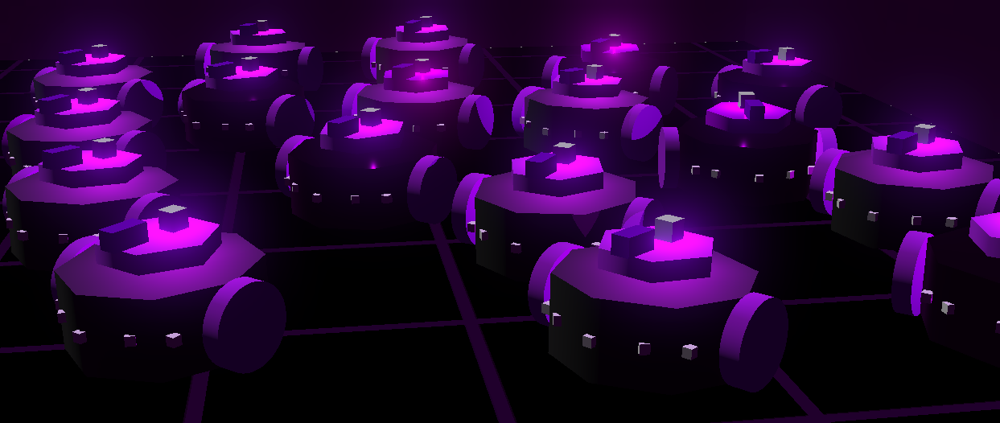

# Swarm Robotics Project (Search and Rescue using Biomimetic algorithms)

This repository contains a multi-agent swarm robotics simulation implemented using Webots. It demonstrates autonomous coordination among a group of robots to perform distributed exploration, mapping, and role-based task execution using behavior-based control and communication. The robots dynamically assign roles such as **Queen**, **Keeper**, **Scout**, and **Crawler**, and collaborate to identify and investigate areas of interest.

## Project blog

The project can be found here: https://pneumaware.blogspot.com/

## Features

- Decentralized swarm coordination
- Role-based robot behavior switching (Queen, Keeper, Scout, Crawler)
- Path memorization and broadcasting of exploration success
- Obstacle detection and avoidance using distance sensors
- Lidar and GPS for environmental awareness and localization
- A* path planning integration (import assumed from `astar.search`)
- Visual feedback via robot LEDs
- Victim detection and path investigation loop

## How It Works

Each robot initializes with a randomly generated unique ID and configures its sensors, motors, GPS, IMU, and communication modules. Robots periodically broadcast their state and receive data from nearby peers.

### Role Assignment Logic
Roles are dynamically chosen based on proximity to the base and neighbor states:
- **Queen**: Assigned when no other Queen is nearby at the base and the robot has the highest ID.
- **Keeper**: Default role maintaining base defense and coordination.
- **Scout**: Explores unknown regions and memorizes paths to targets.
- **Crawler**: Investigates paths broadcasted by Scouts upon Queen's assignment.

### Behavior Summary
- **Scouts** patrol the environment, searching for victims or key points.
- **Keepers** maintain positions near the base and coordinate data flow.
- **Crawlers** investigate promising paths shared by Scouts.
- **Queens** consolidate information and assign high-priority tasks.

### Communication
All data is shared via Webots' emitter and receiver devices in a structured message format. Path data includes coordinates and classification (e.g., "found", "failed").

## Requirements

- Webots simulator
- Python (used within Webots context)
- `numpy`, `math`, `string`, `random`, `keyboard`
- A* pathfinding module (`astar.search`) — assumed present

## Running the Simulation

1. Open Webots and load the world containing this robot controller.
2. Assign `basic_swarm_controller.py` to each robot.
3. Start the simulation.
4. Observe role switching, path finding, and swarm behavior via console or robot LEDs.

## TODOs

- Integrate camera-based recognition for victim detection
- Tune role switching logic thresholds
- Improve map representation and visualization
- Extend inter-robot task delegation strategies

## License

This project is open-source and free to use for research and educational purposes.
